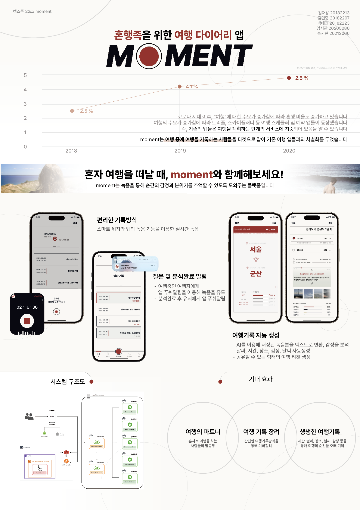
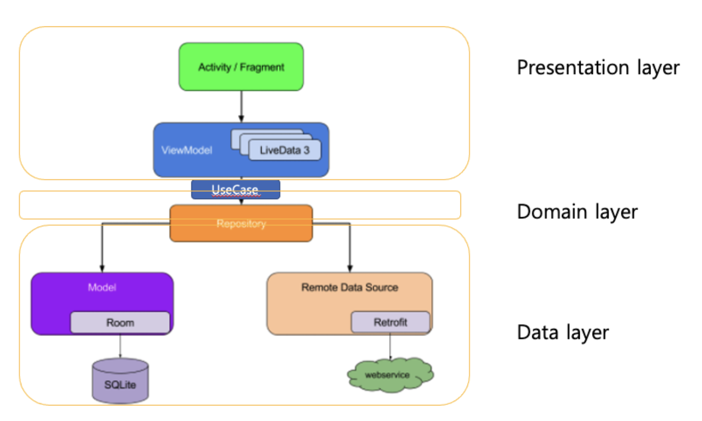
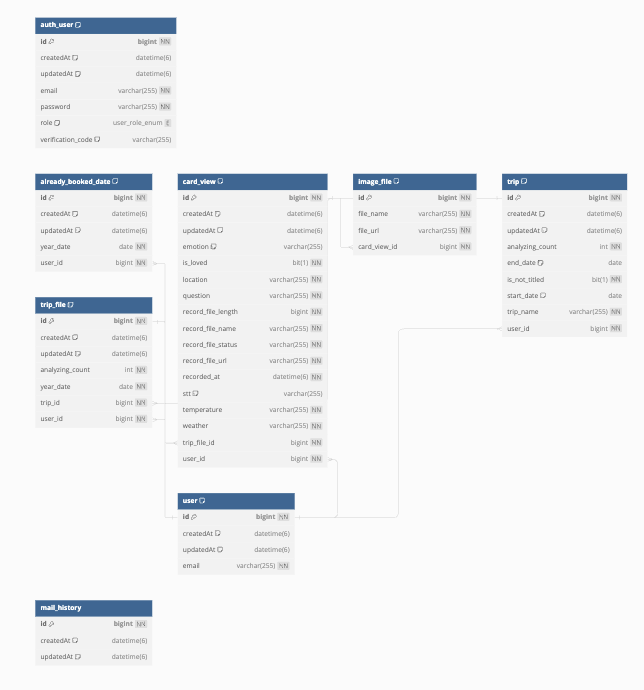
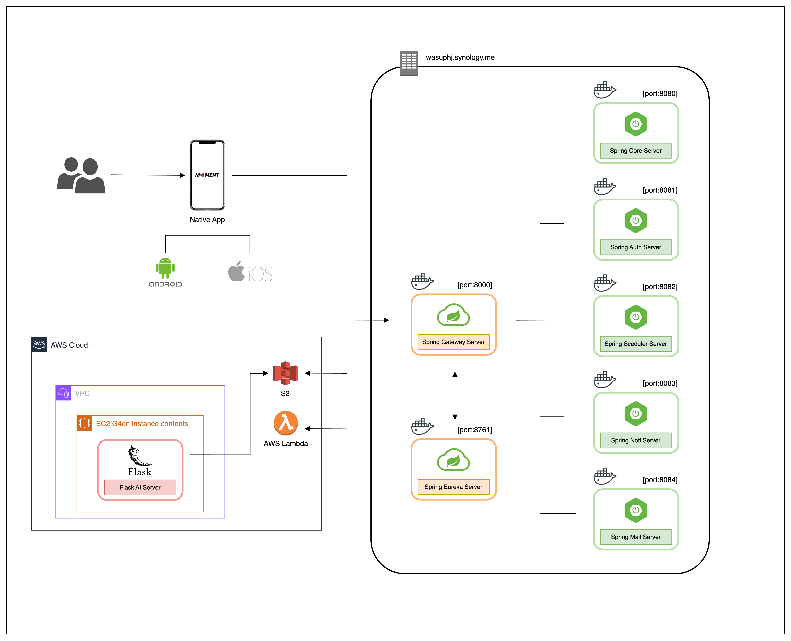
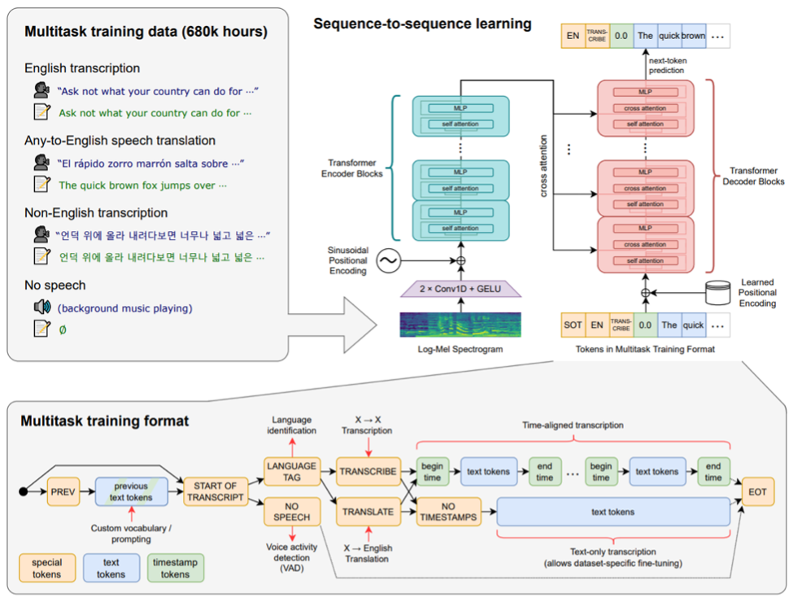
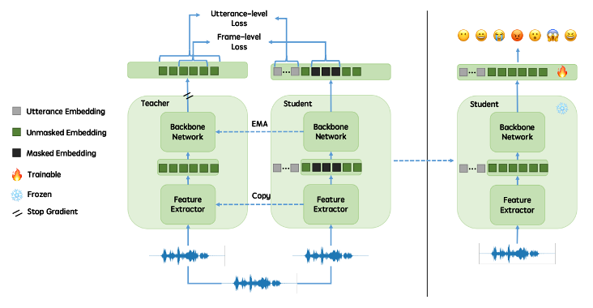

# 목차
1. [프로젝트 소개](#🛠-프로젝트-소개)
2. [포스터 및 소개 영상](#포스터-및-소개-영상)
3. [팀 소개](#👩🏻‍💻-팀-소개)
4. [배포가이드](#배포가이드)
5. [설계](#설계)
6. [문서](#문서)
7. [기타](#기타)

  

# 🛠 프로젝트 소개
## **한줄 소개**  
혼자 하는 여행 중 친구처럼 던진 질문에 답을 하거나 개개인의 다양한 경험을 스마트 워치를 이용해 음성으로 간편하게 기록하고,  
AI를 활용하여 자동 텍스트 변환, 감정 분석, 기록 아카이빙까지 제공하는 음성 인식 다이어리 앱입니다.

## **핵심 기능**
1. 웨어러블 디바이스 연동
스마트워치와 같은 웨어러블 디바이스를 연동해 언제나 손쉽게 음성을 기록할 수 있습니다.
2. 음성인식 인공지능
사용자의 음성을 텍스트로 변환해주는 음성인식 인공지능을 도입해 기록한 음성을 텍스트로 변환해 저장해줍니다.
3. 감정분석 인공지능
기록된 음성기록을 인공지능을 통해 분석해 그 당시의 감정을 분석하고 기록해줍니다.
4. 차별화된 여행 기록 제공
녹음을 기록했던 당시의 장소, 날씨, 시간, 기온 등등 그 당시의 데이터를 추가로 제공해 개개인의 여행 상황에 차별화된 여행기록을 제공해줍니다.
5. 고유한 여행 산출물 생성
여행이 끝난 후 각 여행의 산출물인 "여행 티켓"을 만드는 기능을 제공해 여행에 대한 고유한 결과물을 생성할 수 있습니다.

  

# 포스터 및 소개 영상
## 포스터

 

## 소개 영상

  

# 설계
## **Android 설계**  

 

## **iOS 설계**
### Clean arcitecture

 

## **BackEnd 설계**
### ERD  

### Architecture  

 

## **AI 설계**
### 음성인식 모델

### 감정분석 모델

  

# 👩🏻‍💻 팀 소개
🖥 **Frontend**  
이름|역할|개발스택
-------|-------|-----
양시관|iOS|   
김민중|Android| 
홍서현|Android| 

🖥 **Backend**  
이름|역할|개발스택
------|------|---
김재용|Server|   
박태진|AI|  

🖥 **Communication**  
역할|종류
------|------
협업관리|
디자인|
API 문서|
형상관리|

  

# 배포가이드

소스코드제출시 설치법이나 사용법을 작성하세요.

  

# 문서
- [중간발표](https://drive.google.com/file/d/1ELYTpvr5rwQeEEy5aQ8zkQpWVYD6Tc5h/view?usp=sharing)
- [중간보고서](https://docs.google.com/document/d/15EEr-d8ANUgzv2IuLtTUmPRXQ-5MzV7M/edit?usp=drive_link&ouid=100333300987560322826&rtpof=true&sd=true)
- [최종발표](https://drive.google.com/file/d/1NVUngwnnO_g0cqBpgnbIXetWi-n_3aw2/view?usp=sharing)
- [수행결과보고서](https://drive.google.com/file/d/1Ige8NZsifMVasT25bFnQQ1b8EKNBFPVM/view?usp=sharing)
- [인쇄용 포스터](https://drive.google.com/file/d/1NlpX4JE9lVlnAaejtYVlCgYRj_xY7Sfm/view?usp=drive_link)
- [최종보고서]()

  

# 기타
## 인공지능
인공지능 모델은 해당 논문 및 깃헙을 참고하여 구현하였습니다.

Whisper
- [[Paper]](https://cdn.openai.com/papers/whisper.pdf)
- [[github]](https://github.com/openai/whisper)

emotion2vec
- [[Paper]](https://arxiv.org/pdf/2312.15185.pdf)
- [[github]](https://github.com/ddlBoJack/emotion2vec)

