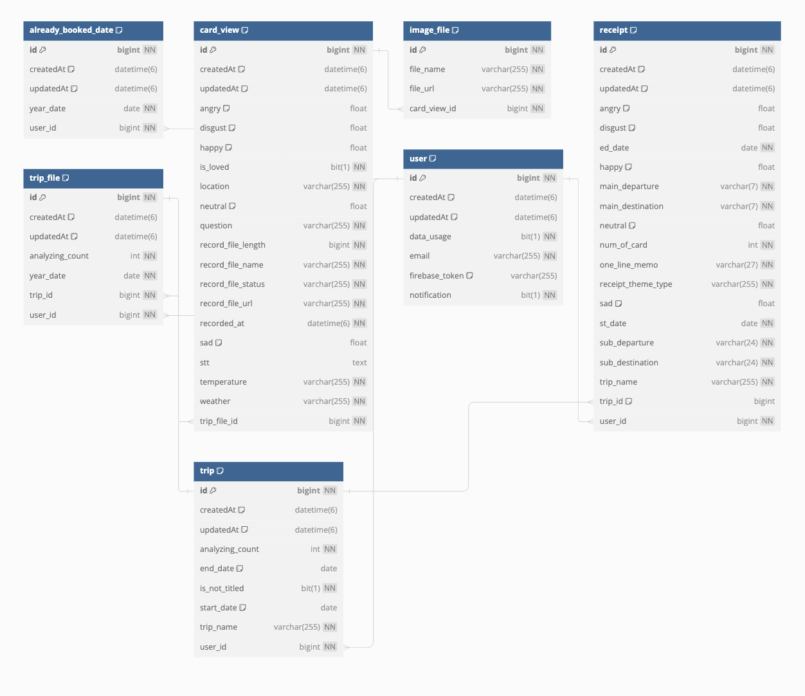

# 목차
1. [프로젝트 소개](##-프로젝트-소개)
2. [소개 영상](##-소개-영상)
3. [팀 소개](##-팀-소개)
4. [사용법](##-사용법)
5. [기타](##-기타)

##  🛠 프로젝트 소개

**한줄 소개**

혼자 하는 여행 중 친구처럼 던진 질문에 답을 하거나 개개인의 다양한 경험을
스마트 워치를 이용해 음성으로 간편하게 기록하고 이후, AI를 활용하여 자동 텍스트 변 환, 감정분석, 기록 아카이빙까지 제공하는 음성 인식 다이어리 앱입니다.

**핵심 기능** 
1. 웨어러블 디바이스 연동
스마트워치와 같은 웨어러블 디바이스를 연동해 언제나 손쉽게 음성을 기록할 수 있습니다.
2. 음성인식 인공지능
사용자의 음성을 텍스트로 변환해주는 음성인식 인공지능을 도입해 기록한 음성을 텍스트로 변환해 저장해줍니다.
3. 감정분석 인공지능
기록된 음성기록을 인공지능을 통해 분석해 그 당시의 감정을 분석하고 기록해줍니다.
4. 차별화된 여행 기록 제공
녹음을 기록했던 당시의 장소, 날씨, 시간, 기온 등등 그 당시의 데이터를 추가로 제공해 개개인의 여행 상황에 차별화된 여행기록을 제공해줍니다.
5. 고유한 여행 산출물 생성
여행이 끝난 후 각 여행의 산출물인 "여행 영수증"을 만드는 기능을 제공해 여행에 대한 고유한 결과물을 생성할 수 있습니다.

**Android 설계**

**iOS 설계**

**BackEnd 설계**
- ERD
- 

- Architecture
- 

**AI 설계**

## 소개 영상

프로젝트 소개하는 영상을 추가하세요

 ## 👩🏻‍💻 팀 소개  
 
🖥 **Frontend**
|이름|역할|개발스택|
|-------|-------|-----|    
|양시관|iOS|  |  
|김민중|Android| |  
|홍서현|Android| |    

🖥 **Backend**
|이름|역할|개발스택|
|-------|-------|-----|    
|김재용|Server|   |  
|박태진|AI|  |  

🖥 **Communication**
|역할|종류|
|-------|-------|    
|협업관리||
|디자인||
|APi 문서||
|형상관리||    

## 사용법

소스코드제출시 설치법이나 사용법을 작성하세요.

## 기타

추가적인 내용은 자유롭게 작성하세요.

